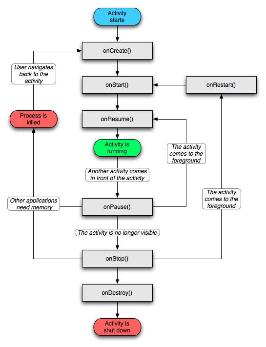

# Activity

**目录**

<!-- vim-markdown-toc GFM -->
* [生命周期](#生命周期)
    * [生命周期回调](#生命周期回调)
    * [需要注意的点](#需要注意的点)
* [Activity 的 LaunchMode](#activity-的-launchmode)
* [Activity 设计的好处](#activity-设计的好处)
* [如何一次终止所有 Activity](#如何一次终止所有-activity)

<!-- vim-markdown-toc -->

## 生命周期

### 生命周期回调



### 需要注意的点

1. 如果有数据需要持久化，在 onPause() 的时候就做，因为 onStop() 返回之后 Activity 随时可能被杀死，而在 Pre-HONEYCOMB 版本里 onPause() 返回之后就可能被杀死。

2. onSaveInstanceState(Bundle) 的调用时机是 Activity 被杀掉之前，onStop() 之前，但因为它不是生命周期回调函数，所以并不能确保所有情况都能被调用到。

## Activity 的 LaunchMode

1. standard，标准模式，这也是默认模式。每次启动一个 Activity 都会重新创建一个新的实例。谁启动了这个 Activity，这个 Activity 就运行在启动它的那个 Activity 所在的栈中。

2. singleTop，栈顶复用模式。如果任务栈的栈顶是目标 Activity 的实例，那么将不会被创建新 Activity，同时栈顶 Activity 的 onNewIntent 会被调用。如果栈顶不是目标 Activity 的实例，则重新创建 Activity。

3. singleTask，栈内复用模式。是一种单例模式。如果栈内存在目标 Activity，那么多次重复启动不会创建新实例，默认具有 clearTop 效果。

4. singleInstance，单实例模式。加强的 singleTask，这个模式的 Activity 只能单独地位于一个任务栈中。

## Activity 设计的好处

* 可以很方便地调起别的 Activity（包括应用内和应用外）并获取调用结果。

* 不可见状态就停止活动，节约系统资源。

* 用栈管理，切换行为符合用户心理预期。

## 如何一次终止所有 Activity

可以使用 Intent.FLAG_ACTIVITY_CLEAR_TOP 调用栈底的 Activity，然后用一个标记让它 finish 自己。

```java
Intent intent = new Intent(this, BottomActivity.class);
intent.addFlags(Intent.FLAG_ACTIVITY_CLEAR_TOP);
intent.putExtra(FINISH_ALL, true);
startActivity(intent);
```

或者用一个自定义的比较土的思路：

```java
class BaseActivity extends Activity {
    public static boolean sKillAll = false;

    @Override
        protected void onResume() {
            super.onResume();
            if (sKillAll) {
                finish();
            }
        }
}
```

在想要终止所有 Activity 时，栈顶 Activity 将 BaseActivity.sKillAll 置为 true，然后 finish 自己。
