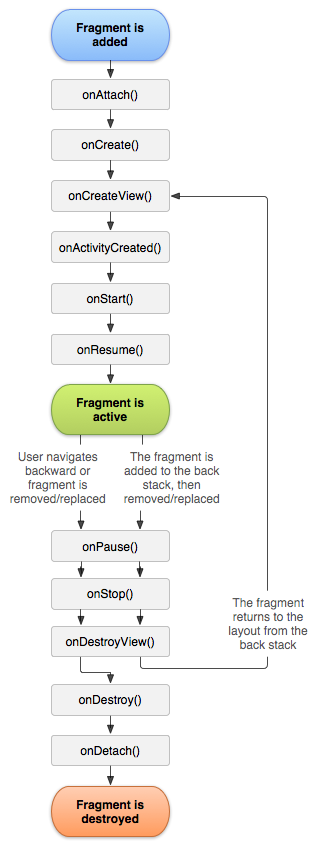
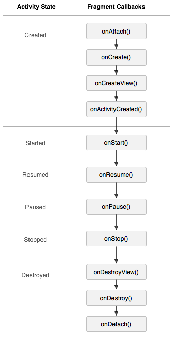

# Fragment

**目录**

<!-- vim-markdown-toc GFM -->
* [生命周期](#生命周期)
* [对应 Activity 状态的 Callbacks](#对应-activity-状态的-callbacks)
* [遇到的问题](#遇到的问题)
    * [点击穿透](#点击穿透)

<!-- vim-markdown-toc -->

## 生命周期



## 对应 Activity 状态的 Callbacks



## 遇到的问题

### 点击穿透

比如一个 Fragment 作为 DrawerLayout 里的 Drawer，点击这个 Fragment 没有控件的部分时，如果被覆盖的 Fragment 或者 Activity 上对应位置有按钮，点击事件会分发到这些按钮上去。

解决办法：

给 Fragment 的根 View 添加 clickable 属性，有两种实现方法，推荐第二种。

1. 给所有需要解决此问题的 Fragment 的 Layout 文件的根结点添加 `android:clickable="true"`。

2. 所有 Fragment 继承自一个基类 BaseFragment，覆盖 BaseFragment 的 `onViewCreated` 方法（该方法会在 `onCreateView` 返回之后被调用），在该方法里用代码设置根 View 的 clickable 属性。

    ```java
    @Override
    public void onViewCreated(View view, Bundle savedInstanceState) {
        super.onViewCreated(view, savedInstanceState);

        // 解决点击穿透的问题
        view.setClickable(true);
        ......
    }
    ```
