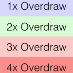

# View

**目录**

<!-- vim-markdown-toc GFM -->
* [GPU 过度绘制](#gpu-过度绘制)

<!-- vim-markdown-toc -->

## GPU 过度绘制

在「开发者选项」-「调试 GPU 过度绘制」可以打开显示。

颜色显示：

* 控件本身的颜色

    绘制一次。

* 蓝色

    绘制二次。

* 绿色

    绘制三次。

* 粉红色

    绘制四次。

* 红色

    绘制五次。

可能的原因：

1. 完全看不到的地方也设置了背景色。

最佳实践：

看不到的界面就不绘制。
